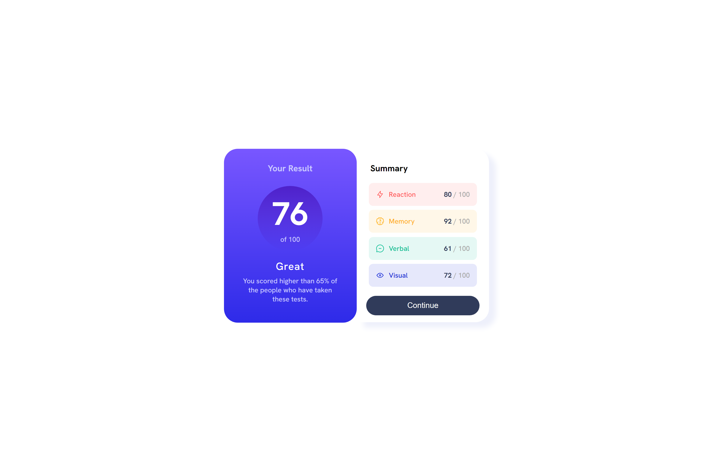

## Table of contents

- [Overview](#overview)
  - [Screenshot](#screenshot)
  - [Links](#links)
- [My process](#my-process)
  - [Built with](#built-with)
  - [What I learned](#what-i-learned)
  - [Continued development](#continued-development)
- [Author](#author)

## Overview

Users should be able to:

- View the optimal layout for the interface depending on their device's screen size
- See hover and focus states for all interactive elements on the page

### Screenshot

### Links

- Solution URL: [Solution](https://www.frontendmentor.io/solutions/results-summary-component-6zpPHXUzZa)
- Live Site URL: [Live](https://genuinemiyashita.github.io/results-summary-component-main/)

## My process

As usual, I started with a mobile approach using Chrome's developer tools and using an iPhone SE as my workbench, followed by an iPad Mini as my next workbench to setup my media queries for the transition between mobile to desktop. Once I got it to look the way that, I went through the code alone making minor touch-ups in terms of font-sizes and alignments.

### What I learned

This challenge helped as additional practice with flexbox as I always feel that I don't understand it as much as I actually do once I start working on a project. This challenge helped me practice styling individual list elements and working with hsla as I tend to favor hex codes.

### Continued development

I want to start incorporating grid either natively or actually start taking the time to start using Bootstrap and/or Bulma. I always end up completely removing them or using an extreme minimal amount, however, I want to complete one project that looks decent that actually uses them to a larger extent.

## Author

- Frontend Mentor - [@GenuineMiyashita](https://www.frontendmentor.io/profile/GenuineMiyashita)
